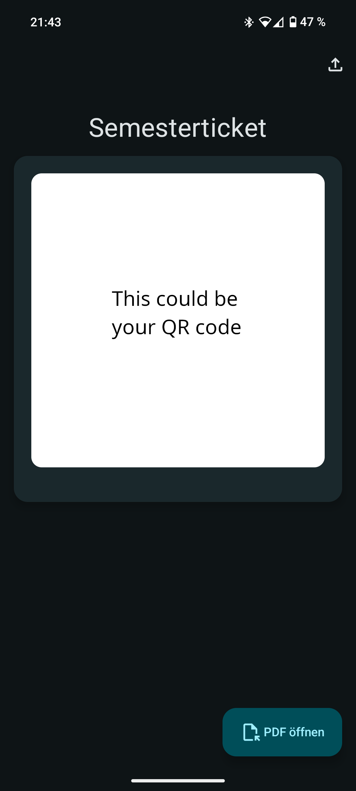

Very simple Android app to display just the QR code of the semester ticket's pdf students get at the Universität Münster. 
It just creates a high resolution image of the pdf, cuts out the QR code and displays it, so no hassle with encryption or
anything. It works but its rough, I used it, but now use [this](https://zügli.app/) to add the ticket to Google Wallet and recommend it. If you still wanna use this app, you have to restart the app after adding your pdf for the QR code to show up. Never fixed that :)

